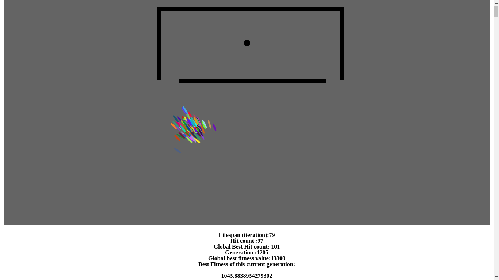
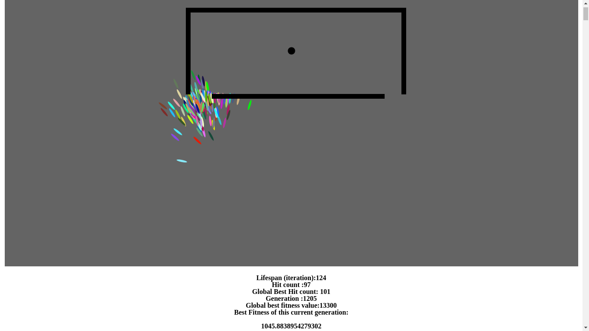
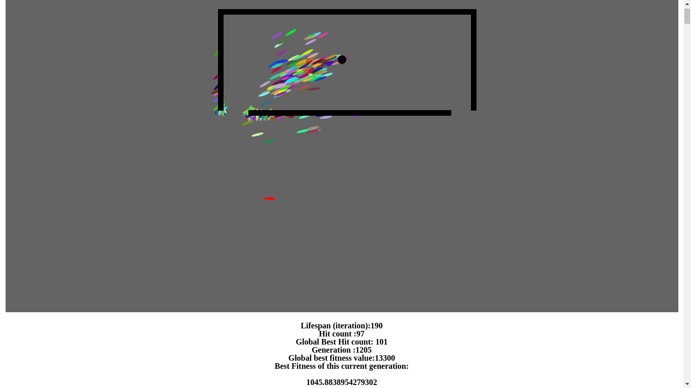

# smartRockets

Used genetic algorithm to direct a group of rockets to a particular target. With passing generation the fitness function keeps on getting better until all the rockets perfectly finds out the way to the target by themselves.

Check this out :-

